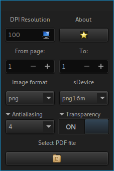

 

The program will be decorated by your gtk theme unless you type **--enable-custom-css**, which will tell to the program to be styled by the custom css in **my_constats.h** file.

## Installation

```bash
autoreconf -if
./configure --prefix=/usr --enable-button-images
make
sudo make install
```

Please translate **po/en_GB.po** in other languages. Open up pull request or issue and I'll merge it.

## Requirements

* gcc/llvm/clang - compiler
* gtk3 - gui toolkit
* glibc / libc - standard C libs
* gettext - internationalization lib
* intltool - internationalization tools
* autoconf - gnu build system
* pkg-config - will locate the gtk libs
* ghostscript - pdf processing
* gawk - some parsing depends on it
